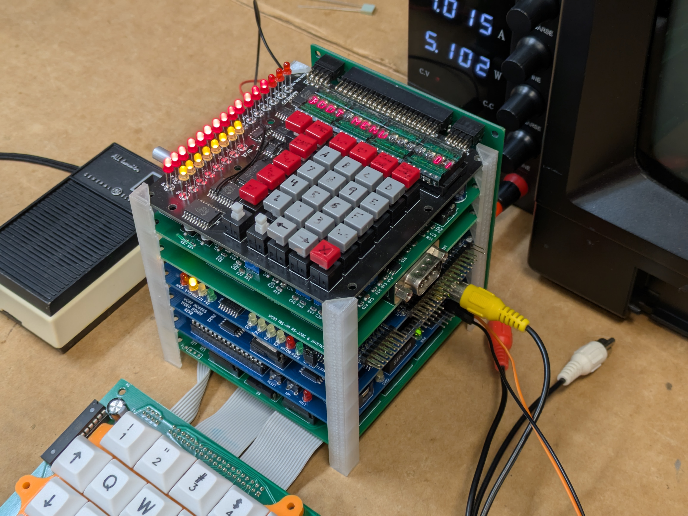
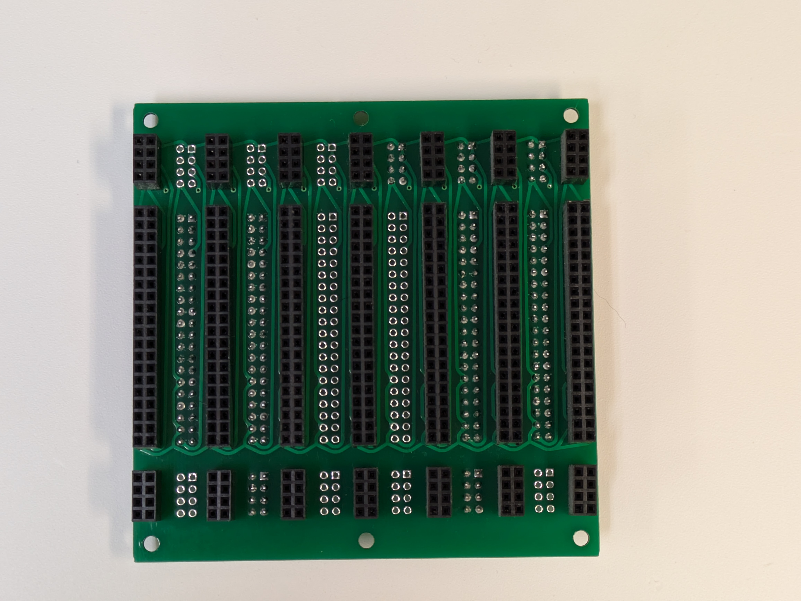
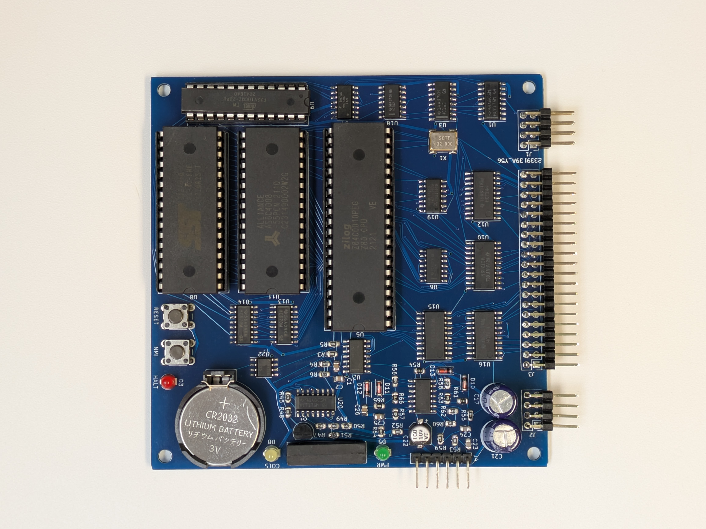
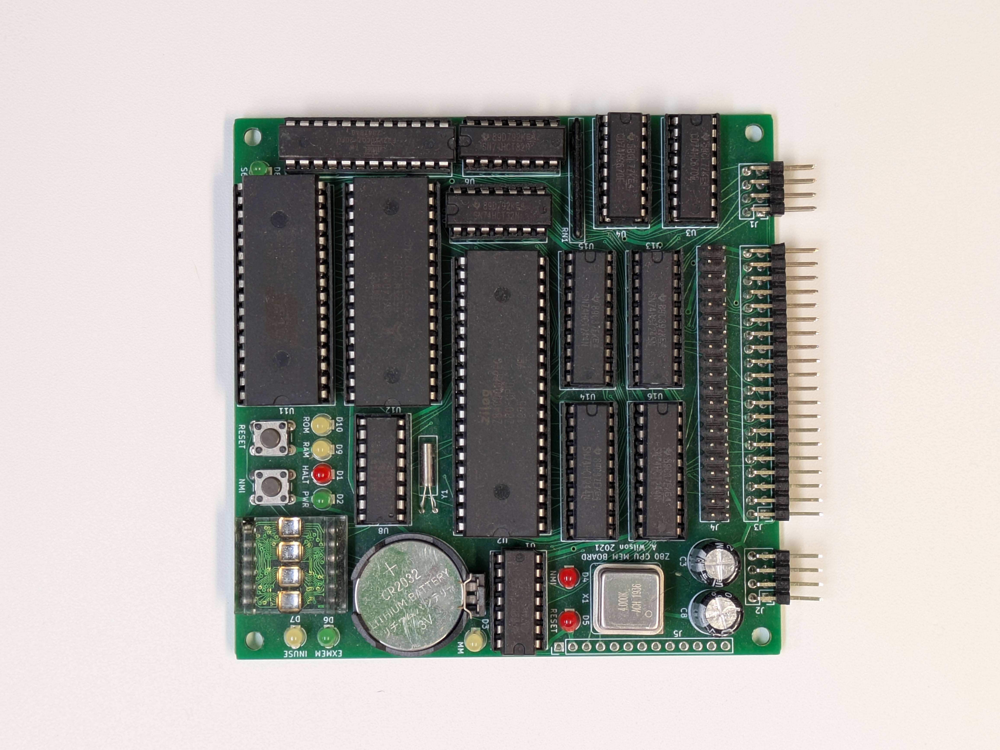

# The WC-80 (archive)



Homebrew Z80 computer which is not exactly a TRS-80 Model 1 clone. 

## Background
Some time ago when I was in college (not that long ago, mind you, it was like 2018), I found a TRS-80 Model 1. It was the first (non-IBM PC) retrocomputer I had ever got my hands on, and in my book, is absolutely legendary, for reasons I'll have to get into some other time. What's important is that what I got was *only* the keyboard, so no power supply, no cables, no display. The first thing I tried to do with it was cobble up a power supply, and wire up an adapter so I could plug the machine into a regular TV's composite video. I powered it on. It was a working unit. 

What you get with just the base Model 1 "keyboard" is:
- Z80 CPU @ 1.77 MHz
- ROM with Level II (microsoft) BASIC
- 16K of RAM
- video output
    - "almost" NTSC / RS170 (black and white only)
    - 64 columns x 16 rows, 6x12 px character resolution, fixed character set
- cassette interface
- the keyboard itself

That's  pretty limiting if you want to do stuff(tm) with the machine. In particular, the cassette interface is a real bottleneck, taking minutes on end to load things, and it's the only way to do so besides typing it in. People thought so too in the TRS-80's heyday, so the platform evolved to have floppy disks, more memory, various operating systems, a serial port, maybe even a hard drive. These were provided by a box that plugs into the TRS-80's keyboard called the 'Expansion Interface (EI)' I did not an Expansion Interface, and they were rare and expensive on Ebay. But, the TRS-80 is old enough that it is made mostly out of standard 74 logic ICs, rather than custom chips like the C64 or later machines have, and all the schematics are right there in the manual. Having more time than any other resource back then, I thought to myself "how hard can it be?"

Following the schematics, this is what led me to create my [hand-wired Expansion Interface unit](https://alnwlsn.com/projectrepository/index.php?title=TRS-80_Model_1_-_Wilson_Expansion_Interface) and had me boot my TRS-80 from a floppy disk for possibly the first time in its life. That was not quite built as stock though:
- SRAM for extra RAM instead of DRAMs
    - why not, RAM is cheap here in the future
    - 128K ram used, in 4 swappable banks of 32K
        - just because I can, haven't done much with this
- Arduino with 1K dual port RAM put in 'hole' in TRS-80 memory map at 0x3000
    - easy and quick way to get data from modern laptop to TRS-80 RAM
- 'equivalent' logic gates, not exact chips used in EI (based on what chips I happened to have or get easily)

The hand built unit had obvious problems though:
- tedious soldering assembly
- unreliable "stacked pin header" interconnects
- not very modular, hard to add more hardware
- fragile

I then started this project to clean up the hand built unit into some real PCBs, which would go into a backplane. If I wanted to add more hardware, I could just make another card. After building most of the EI, I realized that there wasn't all that much to the rest of the computer, so I built modules for that too. Thus, the WC-80 (W Cube Z80) was born.

It's a bit like a Model 1, with some Model III (more IO on the IO ports) and Model 4 (some peripherals like the video ram and keyboard can be moved around in the memory map, and there are multiple banks of memory). The main difference is that most of the hardware options are software controlled, so it needs to boot a rom that can initialize all the hardware, then load the TRS-80 ROMs and jump to the beginning of it.

As the system took shape, I thought I might install it into a case, and make a portable machine, but soon obtained a good number of real TRS-80 machines to work on instead. I haven't touched the WC-80 much since around 2022, which means I've forgotten most of whatever I was doing on it. Still, it's probably more useful published here as incomplete than just sitting on my hard drive. When I pick up this project again, I'll probably continue in a new repo, which will be linked here if it exists.


## General guidelines:
- 100x100mm typical board size
    - this is the cheap "loss leader" size offered by PCBWay and JLC. A board twice this area costs more than double the price.
- where possible, SMD SOIC packages
    - much more compact than DIP, but still easily solderable by hand with an iron
        - plus, you don't have to flip the board over
- 2 layer boards (cheapest)
- 0.2mm track width for data signals
    - fits between SOIC pads
- 74HCT (CMOS w/ TTL level inputs) over HC or LS parts, where possible
- autorouted (w/ some manual routing) with [TopoR](https://en.wikipedia.org/wiki/TopoR)
    - usually get my fill of manually routing boards at work
- designed around whatever ICs I can get for cheap
- fit as much stuff as I can onto each board
    - I paid for the whole board, I'm gonna use the whole board

## Boards
### Backplane

- 40-pin interconnect is derived from the 40-pin card edge on the back of the TRS-80 Model 1, though a few pins are different, so it can't be plugged in directly.
- 8 pin connectors on either side are for power and misc. signals.
- [next revision](boards/backplane2/new/) is just a straight interconnect, which is how it probably should be.
- [this version shown](boards/backplane/) has named nets, and the power rails and GNDs are connected together on the backplane.

### CPU board

- Z80 CPU
- memory map divided into 4x 16k slots, into which any 1 of 32 pages of RAM or 1 of any 32 pages of Flash ROM can be installed. 
    - bank selection by IO port
    - whole memory space is filled, but there is an INUSE pin on the backplane by which other boards can signal the CPU board that they want to use the memory space currently being accessed, in which case on-board memory will be disabled
- software selectable clock rate from 1.77MHz to 8MHz
    - CPU clock provided by a 16MHz clock feeding a counter chip which can count from 2 to 9. 16/9 happens to be pretty close to the 1.77MHz of the model 1. You also get more traditional clock rates of 2, 4 and 8Mhz.
- added the Model 1's cassette interface
    - can read and write TRS-80 Model 1 Level II tapes when running Level II ROMs
    - it can even load tapes played back at 4x speed in 8Mhz mode, seems to work just fine
    - includes reed relay for cassette remote switch
- battery backed RAM with integral RTC via [DS1315 Phantom Time chip](https://www.analog.com/en/products/ds1315.html)
    -   to get and set the RTC, you write a sequential series of special bytes to the RAM and the next byte written will come from the RTC
        - execution must be done either in a ROM or from external RAM, since you can't be both read the instructions and write the special sequence while being on the internal RAM
        - probably get rid of this in the next version, the Arduino board has the same thing already
- [I think this is the current version of the CPU](boards/cpu/cpu-rev2/)

### Old CPU

- [despite being called 'cpu5' and the new one being 'cpu2', this is the older one](boards/cpu/cpu5/)
- same as the current CPU board, only using DIP chips and having a HP Dl1414 4-character LED display instead of the cassette interface. This display is usually not visible, so I got rid of it.

```alnwlsn-ssg
title: The WC-80 (archive)
subtitle: homebrew TRS-80 I made one time
date: 2025-07-16
labels: retrocomputing, trs80
```
